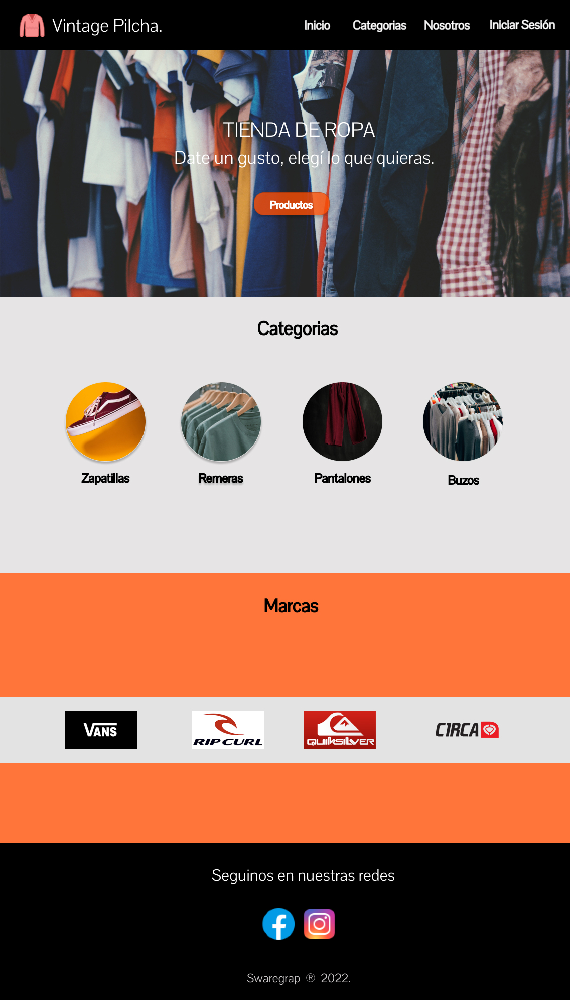

#  _Vintage Pilcha_

###  :pushpin: Requerimientos Funcionales:
- Una tienda de compra y venta de  ropa vintage ubicada en el barrio de palermo necesita el desarrollo de una pagina web para promicionar sus productos que va a vender e intercambiar vía redes sociales.

- En principio necesita contar con una landing page que cuente con un menú de navegación con diferentes secciones, diseño de su marca  y  enlaces a sus respectivas redes sociales.
- En una segunda etapa de desarrollo la empresa tiene la idea de integrar su página web

##  :closed_book: _Documentación_:

###  :pencil2: Mockup -  _Diseño realizado en Figma_ 

## :file_folder: Web development:

 - html5.
 - css3.
 - Javascript.

## :iphone: Responsive Design:
 - Uso de media Query para adaptar la página a diferentes dispositivos.
 - cambios de estilos  css generales en los diferentes tamaños de medidas de los dispositivos.
 - Menú hamburguesa  desplegable con animaciones a partir de la medida en dispositivos de 768px.

##  :computer: Web Site:

  -  https://vintage-pilcha.netlify.app/

